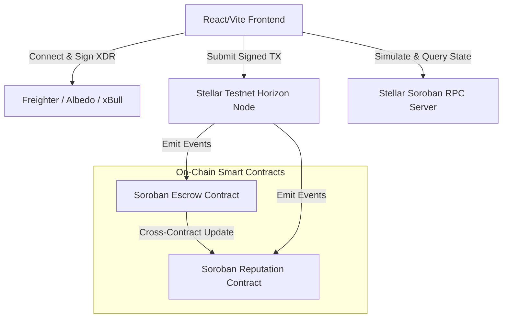

# StellarPay

[](https://github.com/StellarPay/stellarpay/actions)
[](LICENSE)
[](https://stellar.org)
[](https://react.dev)
[](https://vite.dev)

StellarPay is a decentralized escrow and reputation platform built on the Stellar network and powered by Soroban smart contracts. It enables trustless escrow transactions (locks, releases, refunds, concessions) while automatically computing on-chain reputation trust ratings for all participants.

---

## Features

*   **Multi-Wallet Support**: Secure connections for Freighter, Albedo, and xBull wallets using a unified selector system.
*   **Decentralized Escrow Manager**: Lock XLM tokens into smart contracts, release on completion, request refunds, or open disputes.
*   **Trust Reputation Dashboard**: Dynamically tracks user success rates, completed deals, disputes, and total settled volume.
*   **Trust Leaderboard**: Global leaderboard highlighting the top-performing escrow partners with interactive profiles and badges.
*   **Transaction Lifecycle Tracker**: Real-time visual timeline (`Signing` → `Submitted` → `In Ledger` → `Confirmed`) with block explorer links.
*   **Notification Center**: Real-time user alert center for tracking pending deposits, dispute actions, and releases.
*   **Live Event Feed**: Polled activity feed showing live platform updates from Soroban smart contract logs.
*   **Mobile-Responsive Design**: Tailored UI featuring a tabbed navigation panel for optimal viewing on smaller screens.
*   **CI/CD & Tests**: Automatically validated via GitHub Actions for Rust contract tests and client production builds.

---

## Architecture



---

## Smart Contracts

The contract methods are executed directly on the Stellar Testnet:

*   **Escrow Contract Address**: `CDX4S5C6Y7U8I9O0P1L2K3J4H5G6F7D8S9A0P1O2I3U4Y5T6R7E8W9Q`
*   **Reputation Contract Address**: `CBXBU753G3K2M6YV6N7R8E9T0Y1U2I3O4P5L6K7J8H9G0F1D2S3A4P5O`

---

## Screenshots

### Dashboard
*(Placeholder for Dashboard: shows total volume, transaction logs, and recent activities)*

### Wallet Selection
*(Placeholder for Wallet Selection Modal: Freighter, Albedo, and xBull choices)*

### Escrow Manager
*(Placeholder for Escrow Manager: lockup input form and active contract actions)*

### Reputation Dashboard
*(Placeholder for Reputation Dashboard: trust rating, completed/failed counts, leaderboard)*

### Notifications
*(Placeholder for Notifications bell dropdown panel and unread markers)*

### Mobile View
*(Placeholder for Mobile View: responsive tab bar layout and custom fit screens)*

---

## Technology Stack

*   **Frontend**: React 19, Vite 8, Tailwind CSS v4, Lucide Icons, Framer Motion.
*   **Blockchain**: Stellar SDK, Soroban Smart Contracts, Stellar Testnet Horizon.
*   **DevOps**: GitHub Actions (Ubuntu workflows), Vercel SPA deployment.

---

## Installation

1. Clone the repository:
   ```bash
   git clone https://github.com/your-username/stellarpay.git
   cd stellarpay
   ```
2. Install dependencies:
   ```bash
   npm install
   ```
3. Set up environment variables:
   ```bash
   cp .env.example .env
   ```

---

## Running Locally

To run the React developer environment locally:
```bash
npm run dev
```
Open `http://localhost:5173` in your browser.

---

## Testing

### Integration Tests
To run the automated ESM integration tests:
```bash
node --test tests/stellar.test.js
```

### Smart Contract Unit Tests
To run the Rust smart contract unit tests:
```bash
cd contracts
cargo test
```

---

## Deployment

The application is optimized for static hosting platforms like Vercel or Netlify.

### Production Build
Create the production-ready build files:
```bash
npm run build
```

### Preview Locally
Preview the production build locally:
```bash
npm run preview
```

---

## CI/CD

The repository is configured with a GitHub Actions workflow in `.github/workflows/stellar-ci.yml`.
Every push or pull request automatically triggers:
1. **Rust Contract Checks**: Compiles smart contracts and runs all unit tests inside `contracts/`.
2. **Frontend Assets Checks**: Installs Node modules and runs `npm run build` to verify the React code compiles.

---

## Contract Deployment (Stellar CLI)

To deploy the Soroban smart contracts on Testnet manually:

1. **Build contracts**:
   ```bash
   cd contracts
   cargo build --target wasm32-unknown-unknown --release
   ```
2. **Deploy Reputation Contract**:
   ```bash
   stellar contract deploy \
     --wasm target/wasm32-unknown-unknown/release/stellarpay_reputation.wasm \
     --source admin_key \
     --network testnet
   ```
3. **Deploy Escrow Contract**:
   ```bash
   stellar contract deploy \
     --wasm target/wasm32-unknown-unknown/release/stellarpay_escrow.wasm \
     --source admin_key \
     --network testnet
   ```

---

## Transaction Verification

All StellarPay transactions submit transaction hashes to the Stellar network. You can verify transactions using the transaction hash by visiting:
*   [Stellar Expert (Testnet Explorer)](https://stellar.expert/explorer/testnet)

Example Transaction Hash: `t_5c3ab87901de49bc98ef7a123bcdef56`

---

## Future Improvements

*   **Decentralized Dispute Resolution (Oracles)**: Implement multi-signature dispute resolution powered by authorized public judges.
*   **Multi-Asset Escrow**: Support ERC-20 equivalent Stellar assets (e.g. USDC, EURC) alongside XLM.

---

## License

This project is licensed under the MIT License - see the [LICENSE](LICENSE) file for details.
